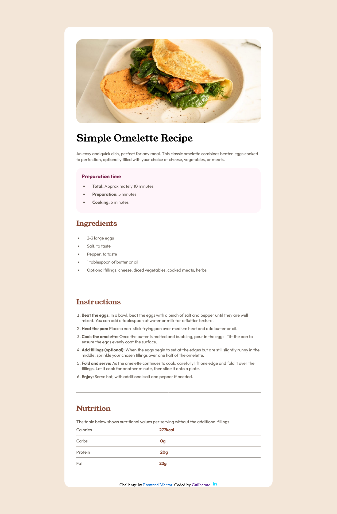

<h1 align="center"> Omelete </h1>


### Link
<p><a href="https://munizgdm.github.io/omelete/" target=""_blank>Live Site URL</a></p>

## ✔️ Construido com:

- Semântica HTML5
- CSS3
- Flexbox

### O que eu aprendi

```
HTML

Melhorando a forma como dou um nome a class, sim era pior.

<h2 class="conteudo-titulo-primario">Ingredients</h2>
  <ul class="lista-principal" type="square"> 
    <li class="lista-principal-espaco">2-3 large eggs</li>
    <li class="lista-principal-espaco">Salt, to taste</li>
    <li class="lista-principal-espaco">Pepper, to taste</li>
    <li class="lista-principal-espaco">1 tablespoon of butter or oil</li>
    <li class="lista-principal-espaco">Optional fillings: cheese, diced vegetables, cooked meats, herbs</li>
  </ul>
```

```
CSS

Utilizar o Flexbox de uma maneira melhor:

body {
    width: 100%;
    height: 100%;
    background-color: hsl(30, 54%, 90%);
    display: flex;
    flex-direction: column;
    align-items: center;
}
```
### Continue a desenvolver

A ideia é continuar melhorando a minha base de HTML5 organizando melhor as classes, refinar o uso do flexbox e aprender mais sobre responsividade. 

### Créditos

Agradecendo ao <a href="https://www.frontendmentor.io" target="_blank">Frontend Mentor</a> que disponibiliza desafios para a comunidade. 
